# Problem after second evaluation

Somehow after the second evaluation, the training becomes very slow. I have no idea why, but it seems to be related to the evaluation and maybe some memory leak or something.

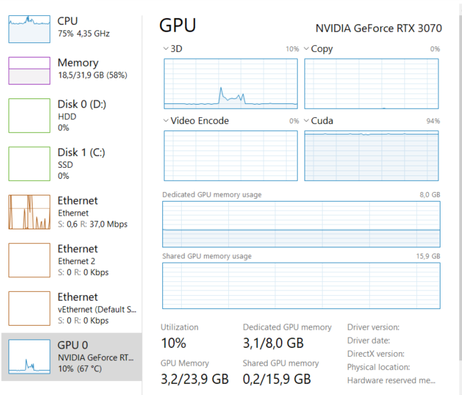

eval 1

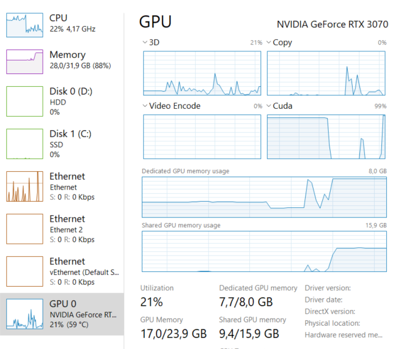
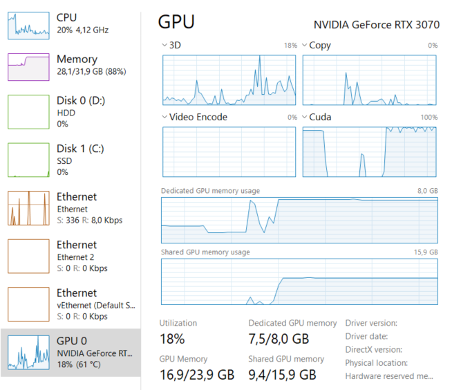

train again

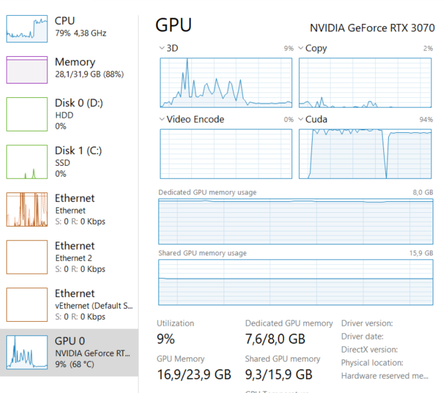

eval 2

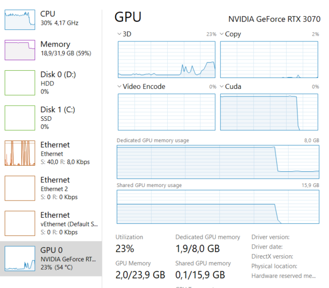
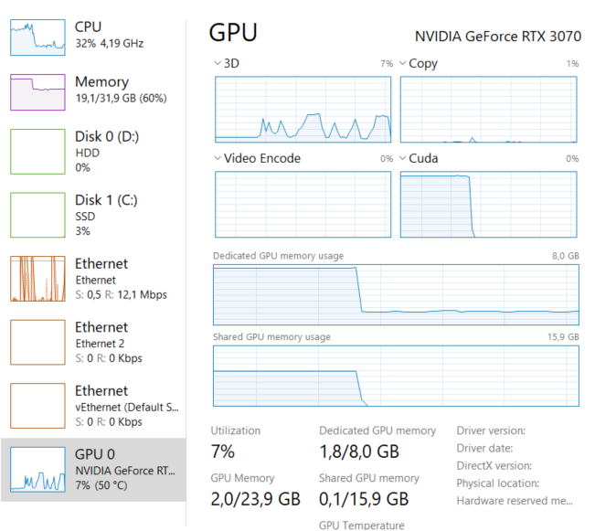

why does it empty everything? a does nothing for 1-2 min

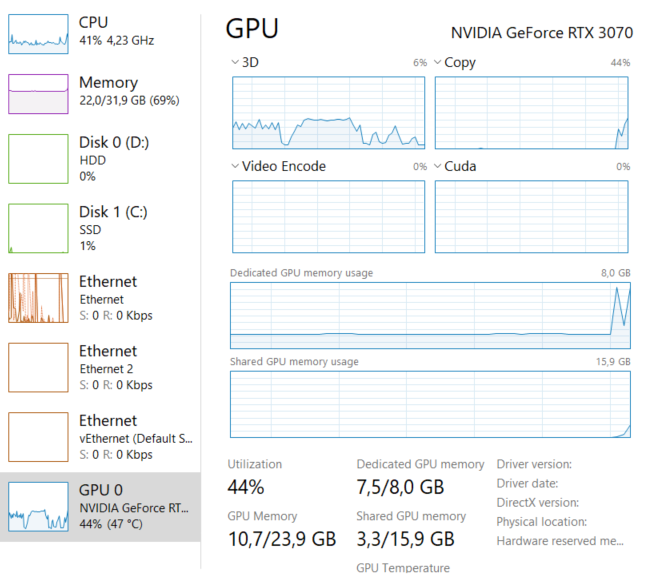

then strats to do something

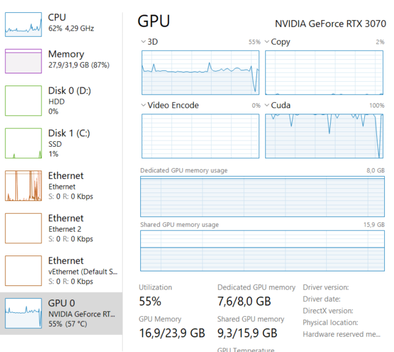

train slow

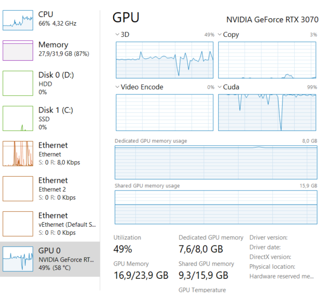

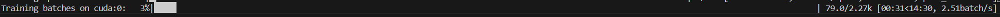

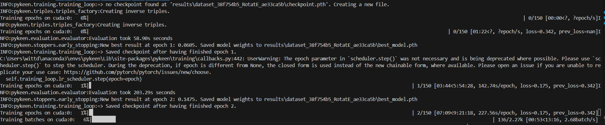

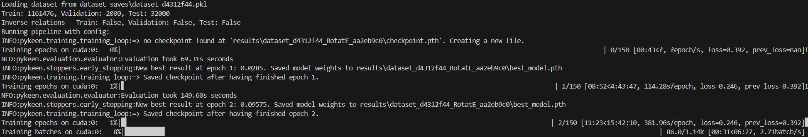